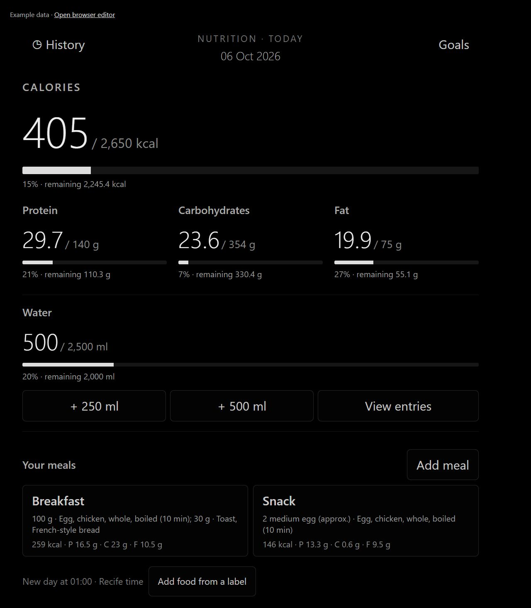

# MMM-DietCalories


A nutrition diary for [MagicMirror²](https://magicmirror.builders/). Add and edit meals in your desktop or mobile browser, then follow calories, protein, carbohydrates, fat, water and daily history on your smart mirror. Devices allowed on the local network share one diary. It is important to note that the foods available and their nutritional values ​​are based on the TACO (Brazilian Food Composition Table), but change it as you wish!.



Created by **Pedro Albelo**, automated tests and practical validation in a smart mirror project. Public release: **0.1.3**.

## Features

- 578 foods from TACO, including prepared Brazilian dishes, with English names, search, categories and favourites.
- Breakfast, lunch, dinner, snack and late-night snack.
- Quantities in grams or servings with editable unit weights.
- Custom foods entered from nutrition labels.
- Calories highlighted, with protein, carbohydrates and fat shown separately.
- Water logging and editable daily goals.
- History with day details and editing of earlier meals.
- A new nutrition day at 01:00, without deleting history.
- A responsive browser editor with mouse, keyboard, touch and scrollable lists.
- Local storage, with no account or external nutrition API required.

## Requirements

Prepared and tested with MagicMirror² 2.38.0 on Windows. Use a Node.js version supported by your MagicMirror installation; the module's development scripts require Node.js 22 or later. There are no module-specific npm dependencies to install: the server uses the Express installation supplied by MagicMirror.

## Manual installation


```cmd
cd /d "C:/path/to/MagicMirror/modules"
git clone https://github.com/PedroAlbelo/MMM-DietCalories.git
```

Add a single instance to the `modules` array in `MagicMirror/config/config.js`:

```js
{
  module: "MMM-DietCalories",
  position: "middle_center",
  config: {}
},
```

Restart MagicMirror. Adjust `position` to suit your mirror's arrangement. See [docs/config.example.js](docs/config.example.js) for a configuration example.

## Desktop and mobile editor

On the mirror computer: [http://localhost:8080/MMM-DietCalories/](http://localhost:8080/MMM-DietCalories/).

On a phone or another computer on the same network: `http://MIRROR_IP:PORT/MMM-DietCalories/`. Substitute your installation's IP address and port.

MagicMirror's server address, IP allowlist and firewall must permit access. The module preserves these settings. **There is no login:** devices allowed to access the MagicMirror server can read and edit the shared diary. The editor is intended for a trusted local network; do not expose its router port to the internet.

1. Click or tap **Add meal** and choose a meal type.
2. Select foods using search, categories or favourites.
3. Adjust quantities and click or tap **Save meal**.
4. Open an existing meal to edit it. History also lets you correct earlier days.
5. Use **Goals** to change daily targets and the water buttons to log drinks.

After saving, the editor receives the server's response and the mirror panel updates. Other editors check the data revision every three seconds. Reopen a meal if the application reports that another device has changed it.

## Installer with backups

You can also use a copy of this module **outside the installed module folder** to preview and apply an installation:

```cmd
node scripts/install.cjs "C:/path/to/MagicMirror"
node scripts/install.cjs "C:/path/to/MagicMirror" --install
```

The first command previews the plan. The second copies the files and adds or enables the module, with backups. Other modules, network settings and existing nutrition options are preserved. No particular page or layout system is required.

To update an existing installation from an external copy:

```cmd
node scripts/install.cjs "C:/path/to/MagicMirror" --update-only
```

Close MagicMirror first. This option updates module files and preserves `config.js` byte for byte. The diary is stored outside the module folder and remains intact during updates.

## Data, goals and sources

Default diary: `~/.magicmirror/MMM-DietCalories/diary.json`, in the operating system user's home directory. `config.dataFile` accepts an alternative absolute path, kept outside public folders and the repository. Example: `config: { dataFile: "D:/PrivateData/DietCalories/diary.json" }`.

The initial profile in `diet-core.js` is an example with a generic name. It is copied only when a new diary is created. **Goals** changes the targets, but does not edit age, weight or height. The initial goals are illustrative estimates; the application logs food and does not prescribe a diet or guarantee a weight-gain deadline.

TACO values describe 100 g of edible food. Serving weights are approximate and editable. Each meal keeps a snapshot of the nutrition values used, preserving its history. See [data/SOURCES.md](data/SOURCES.md) and [NOTICE.md](NOTICE.md) for sources and methodology.

Version 0.1.3 can read diaries from the earlier Portuguese public release. Built-in meal types, food names, categories and serving labels are translated in memory. Recorded nutrients, weights, goals, dates, identifiers and user-authored food names remain intact. Loading alone does not rewrite the diary; the translated labels are persisted with the next successful edit.

The display uses English number and date formatting, such as `2,650` and `06 Oct 2026`. The nutrition-day boundary remains 01:00 in `America/Recife`; changing the interface language does not change the time zone. This time zone and boundary are currently fixed in `diet-core.js` (It is important for the user to know this if they wish to make any changes).

## Development

Inside `MagicMirror/modules`, the scripts locate MagicMirror automatically. For a copy outside that folder, specify the installation path in CMD:

```cmd
set "MAGICMIRROR_PATH=C:/path/to/MagicMirror"
npm.cmd run check
npm.cmd test
npm.cmd run demo
```

The preview runs at `http://localhost:8094/`; the editor is at `http://localhost:8094/MMM-DietCalories/`. They use example data in `.local/demo/diary.json`, without accessing the real diary. Open both in tabs to check synchronisation. Stop the server with Ctrl+C. `DIET_DEMO_PORT` selects another port; `DIET_DEMO_DATA` selects another example diary file.

There are 15 tests covering calculations, persistence, concurrency, legacy diaries, the API and installation. The 12 core/store tests can also run without Express using

`node --test tests/diet.test.cjs`. `.local`

and diaries are ignored by Git. The catalogue is not yet virtualised;

## Documentation and credits

The [technical manual](docs/ARCHITECTURE.md) explains files, calculations, HTTP routes, persistence, interface, and design decisions. The manual aims to make it easier for any user who installs the system to customize it as they see fit and add any other module. I hope it helps.

`data/foods.json` is derived from the **Brazilian Food Composition Table - Tabela Brasileira de Composição de Alimentos (TACO), NEPA / Universidade Estadual de Campinas, revised and expanded 4th edition, 2011**. The publication permits partial or complete reproduction with attribution. Include this credit when redistributing the data. The module's author did not measure the nutrition values.

- [Official publication](https://nepa.unicamp.br/wp-content/uploads/sites/27/2023/10/taco_4_edicao_ampliada_e_revisada.pdf).
- [Official spreadsheet](https://nepa.unicamp.br/wp-content/uploads/sites/27/2023/10/Taco-4a-Edicao.xlsx).
- Conversion, approximate serving weights and references: [data/SOURCES.md](data/SOURCES.md).

The English food names and categories are editorial translations for this module, not an official English edition of TACO. Regional dish and variety names may remain as proper names, accompanied by English descriptions. Nutrition values and stable identifiers are preserved.

## License

Code is licensed under the [MIT License](LICENSE).

