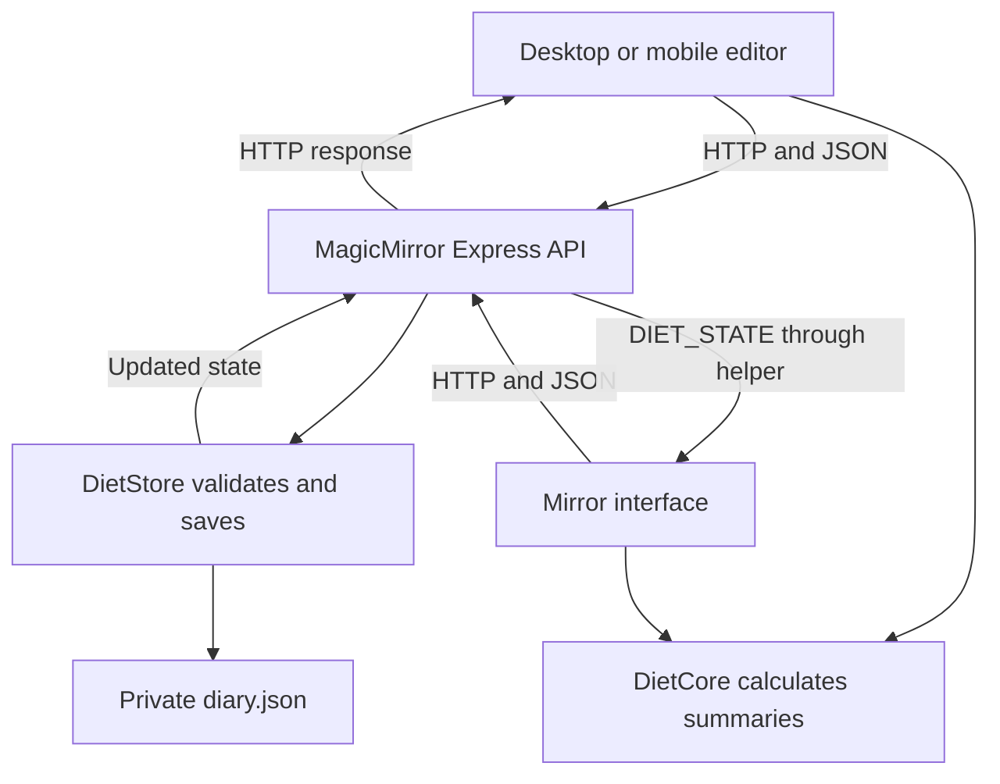

# Technical manual — MMM-DietCalories

This manual describes public release 0.1.3: meal entry and editing in a desktop or mobile browser, with shared results displayed on MagicMirror. It is intended for readers learning the project in VS Code. Function names below can be found in the actual files with Ctrl+F.

## 1. The problem

Users need to log food, see daily totals and review earlier days. Connected devices should see one shared diary. Closing the application or updating the module must not erase entries.

The interface provides calories, protein, carbohydrates, fat, water, meals, goals and history. The food catalogue is local. Mouse, keyboard and touch use the same application, with scrollable lists and visible save actions.

## 2. Technologies

| Technology | Role |
| --- | --- |
| Browser/Electron JavaScript | Builds the interface and handles actions. |
| HTML and DOM | Represent sections, text, fields and buttons. |
| CSS | Controls spacing, sizing, layers and responsive layouts. |
| Node.js | Runs the server code that can read and write the diary. |
| MagicMirror's Express | Receives HTTP requests from both interfaces. |
| JSON | Stores the catalogue and diary. |
| MagicMirror notifications | Deliver updated state from the helper to the mirror module. |
| Git / GitHub | Track and publish code; they do not run the mirror. |

The browser asks the server to save a change; it does not write the diary directly. This avoids separate, unrelated diaries in each phone's browser storage.

## 3. Architecture



There are two interfaces and one source of data. Both instantiate `DietUI.App`. The `mirror` mode uses larger display controls; `editor` supports desktop and mobile browser input. Both send the same data format to the API.

## 4. Files and responsibilities

```text
MMM-DietCalories/
├── MMM-DietCalories.js       MagicMirror module entry
├── node_helper.js           Server entry
├── api.cjs                  HTTP routes and request checks
├── diet-store.cjs           Validation, state and diary persistence
├── diet-core.js             Dates, calculations and summaries
├── diet-ui.js               Shared interface
├── diet.css                 Responsive styling and dialog layers
├── package.json             Version, scripts and requirements
├── .gitignore               Local files excluded from Git
├── NOTICE.md                Attribution and provenance
├── data/
│   ├── foods.json           Food catalogue, values per 100 g
│   └── SOURCES.md           Sources and methodology
├── public/index.html        Remote browser editor
├── demo/mirror.html         Example mirror panel
├── scripts/
│   ├── install.cjs          Installer with backups
│   ├── mirror-path.cjs      Locates a MagicMirror installation
│   ├── demo.cjs             Preview server with example data
│   ├── check.cjs            Syntax checks
│   └── test.cjs             Test runner
├── tests/
│   ├── diet.test.cjs        Calculations and persistence tests
│   └── integration.test.cjs API and installer tests
└── docs/
    ├── ARCHITECTURE.md      This manual
    └── config.example.js    Configuration example
```

`.cjs` files use CommonJS: `require()` and `module.exports`. `diet-core.js` uses an enclosing function to expose the same implementation as `globalThis.DietCore` in the browser and `module.exports` in Node. Calculations do not need separate client and server implementations.

### MagicMirror entry

`Module.register("MMM-DietCalories", {...})` registers the module name. `getScripts()` loads the core and interface; `getStyles()` loads the stylesheet. `getDom()` creates the interface and returns its root element. See the [MagicMirror core module documentation](https://docs.magicmirror.builders/module-development/core-module-file.html).

`DOM_OBJECTS_CREATED` sends `DIET_SUBSCRIBE` to receive initial state. `socketNotificationReceived()` handles `DIET_STATE` and errors. The interface then updates its own DOM instead of creating an entirely new application on each change. `suspend()` closes an open dialog when the module is suspended.

### Server entry

`node_helper.js` creates `DietStore`, chooses the diary path and registers routes on MagicMirror's existing Express instance. It does not open another production port. After a successful save, it sends `DIET_STATE` to the mirror module. Other browser clients receive HTTP responses and poll the revision.

The helper serves `public` at `/MMM-DietCalories/`. See the [NodeHelper documentation](https://docs.magicmirror.builders/module-development/node-helper.html). The folder name, registered name and URLs must agree.

### Core rules

| Function | Result |
| --- | --- |
| `foodTotals(food, grams)` | Calories and macros for a given weight. |
| `summary(day)` | Totals, percentages, remaining amounts and whether goals are met. |
| `dayKey(now)` | Nutrition-day date, switching at 01:00 Recife time. |
| `validDay(value)` | Checks that a calendar date exists. |
| `goalsForDay(state, key)` | Goals effective on the given date. |
| `historyKeys(state, now)` | History dates, including days without entries. |
| `reminder(day, now, name)` | A last-hour reminder when applicable. |
| `estimate(profile)` | Initial example goals for a new diary. |

### Interface

`App` keeps received state, the open dialog and the meal draft. `render()` builds the dashboard. `openMeal()`, `openFoods()`, `openHistory()`, `openDay()` and `openGoals()` open the corresponding views.

`button()` creates an HTML button with an `onclick` action. `change()` sends an API request and accepts changes only after server confirmation. `load()` polls every three seconds, checking `/revision` before downloading a full state. A minute check also updates the date and reminder without requiring new entries.

A draft remains separate from the diary. Selecting five foods and closing a dialog without saving does not create five entries. Favourites are saved separately as a preference.

### Persistence

The store validates requests, rejects future nutrition dates, creates identifiers and owns the shared state. The core has no disk access; the API has no file-writing implementation.

`mutate()` queues operations using Promises, clones state, applies a change and increments `revision`. It writes a temporary file in the diary folder and renames that file into place before replacing state in memory. If writing fails, the previous state remains active and the operation is rejected. This reduces truncated-file risk; it does not replace backups or guarantee recovery from every physical disk failure.

### HTTP API

Prefix: `/MMM-DietCalories/api`.

| Method and route | Purpose |
| --- | --- |
| `GET /state` | Read the diary. |
| `GET /revision` | Check whether state changed. |
| `GET /foods` | Read base and custom foods. |
| `POST /meals` | Add a meal. |
| `PATCH /days/:day/meals/:id` | Edit a meal with its version. |
| `DELETE /days/:day/meals/:id` | Delete a meal with its version. |
| `POST /water` | Add a water entry. |
| `DELETE /days/:day/water/:id` | Remove a water entry. |
| `PUT /goals` | Update goals. |
| `POST /foods` | Add a food from a nutrition label. |
| `PUT /favorites` | Select or clear a favourite. |

Edits send JSON, `Content-Type: application/json` and `X-Diet-Client: MMM-DietCalories`. Request bodies are limited to 32 KB. A supplied origin must match the host. This header is a client marker, **not a password**. The checks reject typical requests from foreign websites; they do not authenticate devices already allowed to access the local API.

## 5. A meal from input to display

1. The user chooses boiled eggs in a new meal.
2. A draft is created. Two eggs at 50 g each become 100 g.
3. Saving sends a request such as:

```json
{
  "day": "2026-10-05",
  "kind": "Breakfast",
  "items": [
    { "foodId": "taco-488", "grams": 100, "unit": "medium egg (approx.)", "quantity": 2 }
  ]
}
```

4. The API calls `store.addMeal()`.
5. The store validates the date, meal type, food and weight. It resolves `foodId` from the catalogue; it does not trust nutrition values supplied in the request.
6. A UUID and version 1 identify the meal. Each food's values and source are copied into the entry.
7. After persistence, updated state returns to the client and the helper notifies the mirror.
8. `summary()` sums foods and `render()` shows the result.

A simplified diary looks like this:

```js
{
  version: 1,               // File format
  revision: 8,              // Global change counter
  started: "2026-10-05",
  profile: { /* Initial profile */ },
  goals: { /* Current goals */ },
  goalHistory: { "2026-10-05": { /* Effective goals */ } },
  days: {
    "2026-10-05": {
      key: "2026-10-05",
      goals: { /* This day's goals */ },
      meals: [
        { id: "uuid", version: 1, kind: "Breakfast", items: [
          { food: { /* Nutrition snapshot */ }, grams: 100, quantity: 2, unit: "medium egg (approx.)" }
        ] }
      ],
      water: [ { id: "another-uuid", ml: 250 } ]
    }
  },
  customFoods: [],
  favorites: []
}
```

Root `version` identifies the file format, `revision` reports state changes, and meal `version` detects conflicting edits. These are different responsibilities.

## 6. Calculations

For each nutrient:

```text
consumed amount = amount per 100 g × consumed weight / 100
percentage = total / goal × 100
remaining = max(0, goal − total)
```

A food containing 10 g protein per 100 g contributes 15 g protein when 150 g is logged. A meal sums its items; a day sums meals and water entries.

Text may show more than 100%, but the progress bar stops at 100%. If a total is still below its goal, rounding must not report success: an actual 99.9% stays at 99% until the goal is met.

TACO energy values are used as supplied. They are not forced to equal protein × 4 + carbohydrates × 4 + fat × 9 because composition data and rounding can differ.

The initial example uses:

```text
resting energy = 10 × weight + 6.25 × height − 5 × age + sex constant
calories = round((resting energy × activity + surplus) / 50) × 50
protein = round(weight × 2)
fat = 75
carbohydrates = round((calories − protein × 4 − fat × 9) / 4)
water = 2500
```

This describes **the implementation**, not a recommendation for every person. Target weight, time frame, training days and training minutes are profile information, but do not directly enter the formula. Activity and surplus are assumptions rather than measurements. See [SOURCES.md](../data/SOURCES.md).

## 7. Dates, history and synchronisation

`dayKey()` uses `Intl.DateTimeFormat` with `America/Recife`. Before 01:00, entries belong to the previous calendar date. At 01:00 the key changes; old entries stay in `days`. Starting a new day does not delete the file. This uses the system clock, even after the application has been switched off.

Each recorded day retains its goals. Changing goals affects today and future days, without rewriting earlier goals. For unrecorded dates, `goalHistory` supplies the goals effective then. **No entries** does not imply the person ate nothing.

A reminder appears only in the last hour of the current nutrition day, when entries exist and the calorie goal has not been reached. It describes the recorded diary; it cannot infer unlogged food.

All devices use the server diary. Saved edits return state immediately, the helper notifies the mirror, and other editors poll `revision` every three seconds. An unsaved draft stays local to its form. Saving an outdated version of the same meal returns HTTP 409 and asks the user to reopen it. Version checks do not cover every kind of goal or preference update.

## 8. Catalogue, search and English labels

`foods.json` contains 578 entries with `id`, `name`, `group`, `per100`, `portions` and `source`. Required missing values are not invented. Approximate serving weights are conveniences supplied by this module.

Search removes accents, normalises case and matches terms. Common English alternatives include aubergine → eggplant, courgette → zucchini, manioc → cassava and maize → corn. This is a text search, rather than universal dish recognition or a continually updated branded-food database. Different preparations should match different entries.

Regional dishes keep proper names alongside English descriptions. The catalogue includes prepared dishes; it does not store ingredient-based recipes or cooking steps. Source credits remain in their original proper names where needed.

Custom foods are stored in `customFoods`; favourites store IDs. Food snapshots preserve historical nutrition when the catalogue changes.

The English release uses `en-GB` number and date formatting. Its display language does not change the fixed 01:00 Recife boundary. Earlier Portuguese public diaries are supported by a label migration in `DietStore.load()`: built-in labels become English, while nutrients, weights, IDs, dates and goals remain unchanged. User-authored food names are preserved. Loading does not write the file; the next successful mutation persists translated labels. The file schema stays at version 1.

## 9. Responsive interface and dialogs

Mirror styles use larger text and controls. Browser editor styles adapt to smaller screens. Lists scroll within dialogs, while action areas remain accessible. Native pointer events support the scrollbar; touch and mouse also support ordinary scrolling.

Dialogs use an opaque layer, mark the background dashboard `inert` and block background scrolling. A secondary category chooser or on-screen keyboard occupies its own top layer. The keyboard is available in mirror mode; desktop/mobile editor fields use normal input. Closing a dialog clears observers and temporary controls.

## 10. Installation and data separation

Clone or copy the module into `MagicMirror/modules/MMM-DietCalories` and add the entry in `config.example.js` to `config/config.js`. The editor URL is MagicMirror's server address followed by `/MMM-DietCalories/`. A standard module position is sufficient; no particular page arrangement is required.

The installer evaluates a trusted local `config.js` to validate it. A delimited configuration block adds or enables one nutrition instance, replaces its previous block when reapplied and avoids duplicates. Existing modules, network settings and nutrition options are preserved. Backups and a staging folder are created before exchanging installed files. `--update-only` replaces module files without changing configuration bytes.

The diary is stored under `os.homedir()` outside public folders. Source code, installation configuration and private entries have separate lifetimes. Publishing or updating code must not publish the diary.

## 11. Tests and maintenance

Reproduce a problem before changing code. Run `npm.cmd run check` for syntax and `npm.cmd test` for the suite. An external development copy uses `MAGICMIRROR_PATH` to locate Express in MagicMirror.

The 15 tests cover the 01:00 boundary, calculation accuracy, catalogue and serving values, add/edit/delete and restart, historical goals, disk failure, concurrent edits, invalid API requests, installation preservation, English labels and migration of legacy diaries.

The demo uses its own example diary in `.local/demo`. Open the editor in another tab, save a meal and check the preview updates. Do not test by editing the real diary. Format changes require an explicit migration and backups; merely increasing `version` does not migrate data.

For debugging, inspect browser Network requests under `/MMM-DietCalories/api`. HTTP 409 is an edit conflict, 400 indicates invalid data, and 403 indicates rejected request origin or headers. A generic 500 message avoids exposing server details. Check MagicMirror's terminal as well.

| Change | Start with |
| --- | --- |
| Sizes, spacing and colours | `diet.css` |
| Buttons, fields and views | `diet-ui.js` |
| Calculations or day boundary | `diet-core.js` and corresponding tests |
| Validation or persisted format | `diet-store.cjs` and a migration plan |
| A new server action | `api.cjs`, a store method and a test |
| Food selection and scrolling | `diet-ui.js` and `diet.css` |
| Module position | The module's entry in MagicMirror's `config.js` |

## 12. Explaining and studying the project

An accurate introduction is: **“I conceived and directed a nutrition module for my smart mirror, developed with AI assistance. I defined the user flows, integrated it into my environment and validated its behaviour. I studied the architecture to maintain and improve the code.”**

Explain decisions and demonstrate a small change with evidence that it works. Credit TACO and show this release's browser workflow: entering or editing meals on desktop/mobile, with shared results on the mirror.

| Question | Answer from this implementation |
| --- | --- |
| Why NodeHelper? | It accesses the diary and MagicMirror server; the interface runs in the browser. |
| Why share a component between devices? | Consistent behaviour with mode-specific styles. |
| How do other devices update? | Server state, HTTP responses, mirror notifications and revision polling. |
| Why JSON instead of a database? | A simple initial local diary needs no separate database service. |
| Can two devices edit? | Mutations queue; stale edits to the same meal are rejected. |
| How is background interaction blocked? | An opaque dialog layer, `inert` and background scroll locking. |
| Is a mobile app required? | No. Open the editor in a browser on the local network. |
| How does rollover work while switched off? | The nutrition date is calculated from the clock, rather than a 24-hour timer. |
| How is saving confirmed? | The server persists before responding with a new revision. |
| Is it a multi-user application? | No. One shared diary, without accounts or individual permissions. |

### Practical study sequence

1. Find every call in the meal example using VS Code.
2. Calculate nutrients for 150 g manually and compare with `foodTotals()`.
3. Run the suite and read the day-boundary test.
4. Adjust a CSS measurement in the demo; inspect desktop, mirror and mobile sizes.
5. Edit a meal in one tab and check another tab and the mirror preview.
6. Make a small improvement on a Git branch and explain its diff and validation.

Possible future work includes a profile editor, configurable time zone and boundary, history export, authentication for a broader network scope, virtualised lists and explicit schema migrations. These are not implemented features of this release.
